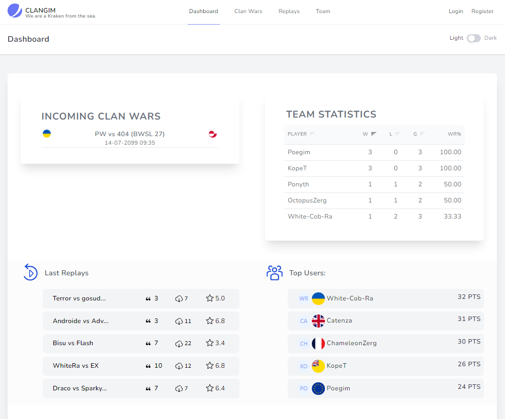
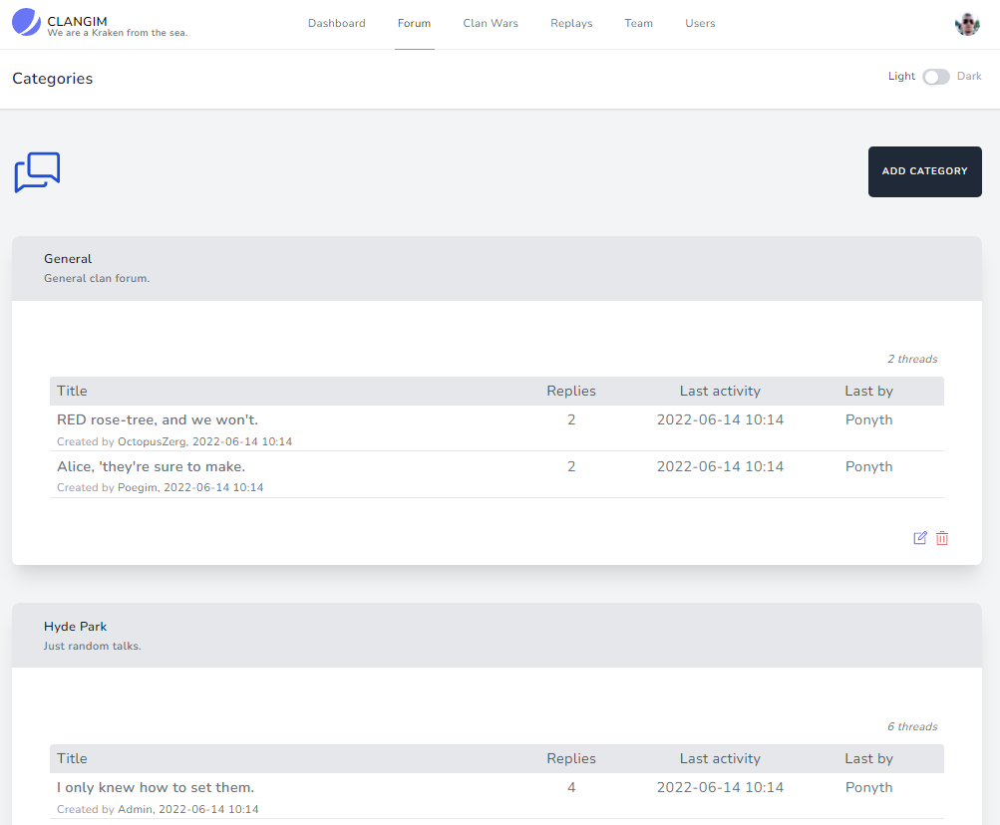
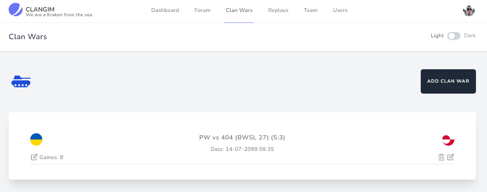
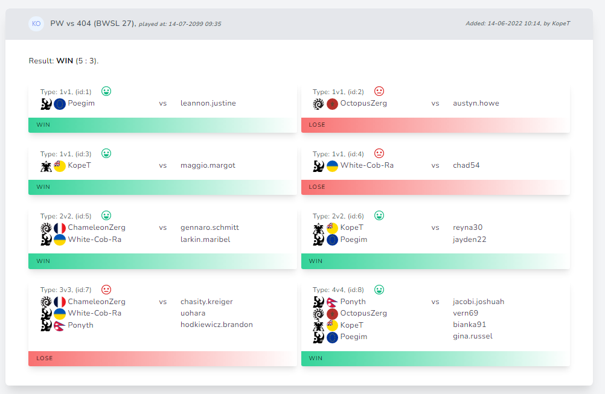
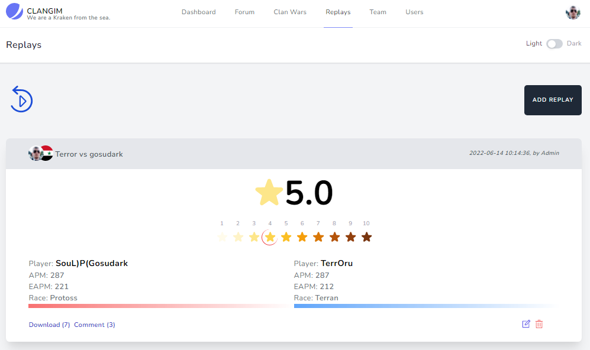
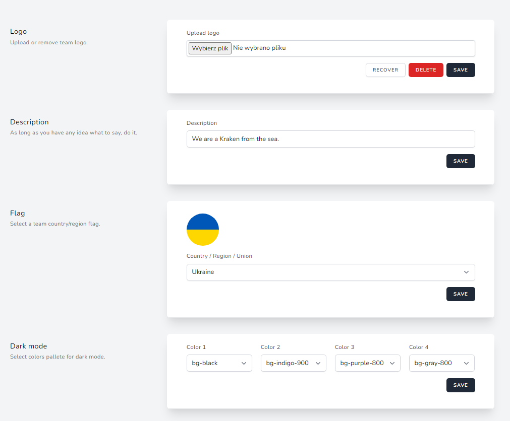
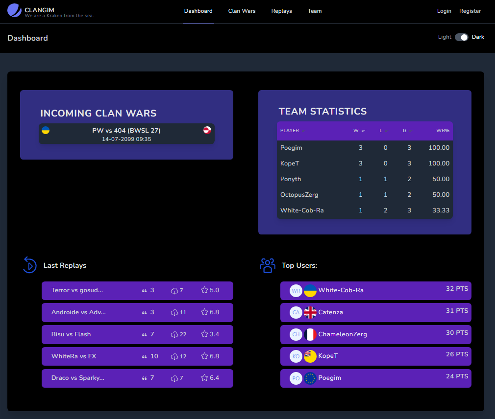
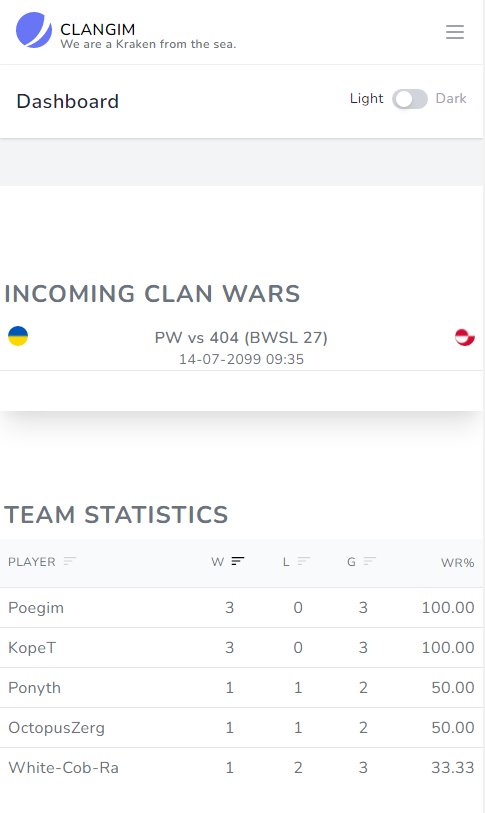

# Clangim
#### Starcraft Remastered Team management system.

## Table of contents
* [General info](#general-info)
* [Technologies](#technologies)
* [Setup](#setup)
* [Media resources](#media-resources)
* [Screenshots](#screenshots)

## General info
Langgim app is simple management system for Starcraft BroodWar/remastered teams. I did this application to expand my knowledge of the technologies I was using, mainly Laravel / TALL stackin this case.

Includes:
+ blog
+ forum with optional hidden subforums 
+ replays module with rating system and metadata parsing powered by [icza/screp](https://github.com/icza/screp)  repository
+ team matches module with player statistics and email notification about incoming clan wars
+ team section
+ users administration section
+ user panel
+ team settings panel (team flag, team logo, <b>dark mode colors pallete</b>)
	
## Technologies
Project is created with:
* PHP 8
* Laravel 8 (Jetstream starter kit)
* TailwindCSS 2
* Livewire 2
* AlpineJS 2
* [Blade UIkit](https://blade-ui-kit.com/)

## Setup

I recommend to deploy it by Laravel Forge. On local machines u can use Laravel Sail to create necessary Docker container.

Clangim requires Queue and Schedule workers, to send email notifications

APP_ENV variable in .ENV file should be set as 'production' on production environment.

Please be sure Config/app.php seeds type is set to "deploy".

## Media resources

Ingame races icons by https://www.pngegg.com/

Flags by <a href='https://www.freepik.com/vectors/icons'>Icons vector created by luis_molinero - www.freepik.com</a>

## Screenshots

#### Dashboard

#### Forum

#### Clan Wars

#### Clan War

#### Edit matches view

#### Replays

#### Team / app settings

#### Dashboard dark

#### Dashboard mobile

